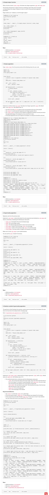

# Pagination

## Resources
* [REST API Design: Pagination](https://www.moesif.com/blog/technical/api-design/REST-API-Design-Filtering-Sorting-and-Pagination/#pagination)
* [HATEOAS](https://en.wikipedia.org/wiki/HATEOAS)

## Setup: `Popular_Baby_Names.csv`
[use this data file](./data.csv) for your project

## Tasks

    

    

        
    

