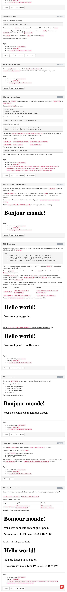

# i18n (Internationalization)
## Resources
* [Flask-Babel](https://pypi.org/project/flask-babel/)
* [Flask i18n tutorial](https://blog.miguelgrinberg.com/post/the-flask-mega-tutorial-part-xiii-i18n-and-l10n)
* [pytz](https://pytz.sourceforge.net/)

## Tasks

